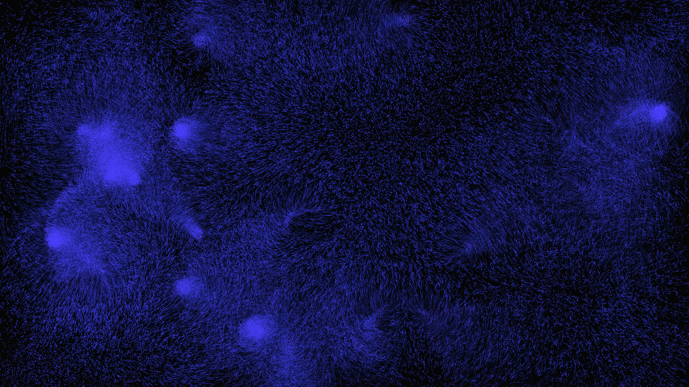

# Screensaver

A simple fullscreen particle-based screensaver written in C++ using SDL2.

The program simulates particles that are attracted to several moving "gravity points", producing colorful motion trails. It is configured for high particle counts and uses blending + a fading render pass to produce smooth trails.



## Table of Contents
- [Screensaver](#screensaver)
	- [Table of Contents](#table-of-contents)
	- [Features](#features)
	- [Installation](#installation)
		- [Dependencies](#dependencies)
		- [Getting the binary](#getting-the-binary)
		- [Build (Windows / PowerShell)](#build-windows--powershell)
		- [Configuration](#configuration)
	- [Run](#run)
	- [Controls](#controls)
	- [Tuning \& Performance](#tuning--performance)
	- [Troubleshooting](#troubleshooting)
	- [Files](#files)
	- [License](#license)

## Features

- Configurable via config file
- Fullscreen desktop mode (uses current display resolution)
- Particle attraction to configurable number of gravity points
- Motion trails via alpha-blended fade
- Color cycling over time
- Lightweight single-file implementation: `screensaver.cpp`

## Installation

### Dependencies

- Install SDL2 (development) and ensure the include/lib paths are available to your compiler.

The project does not use external build tools; it compiles with g++.

### Getting the binary

You can either build the screensaver from source (see below) or download a precompiled binary from the releases page.
Right click on the binary, and choose install. It is now configured as the standard screensaver.

### Build (Windows / PowerShell)

This repository includes a VS Code build task that uses a MinGW/MSYS g++ toolchain to compile the active file with SDL2 and produce a screensaver executable (`.scr`). It expects SDL2 headers/libs installed under your MSYS/MinGW installation (the task uses `C:\msys64\mingw64` paths by default).

If you prefer to build manually from PowerShell, an example command (adjust include/lib paths to match your SDL2 install) looks like:

```powershell
C:\msys64\ucrt64\bin\g++.exe -O3 -ffast-math -fopenmp -flto -DNDEBUG -s -I C:/msys64/mingw64/include \
		screensaver.cpp -L C:/msys64/mingw64/lib -lmingw32 -finline-functions -lopengl32 -lgdi32 -lSDL2main -lSDL2 -lwinmm -o Screensaver.scr
```

Alternatively run the VS Code task named "C/C++: g++.exe build active file with SDL (Release)" from the Run/Tasks menu.

### Configuration

Place a `screensaver.config` file in the same directory as the executable to override default settings. The config file should be a simple text file with key=value pairs, for example:

```
gravity_points=5
particles=25000
cycle_color=1
color_r=0
color_g=255
color_b=0
trail_alpha=10
g=500
damp=99
near_radius=10
respawn_time=500
```

Only int values are supported in the config file, and all parameters have defaults if not specified.
Possible values:
- `gravity_points`: number of gravity points `>0`
- `particles`: number of particles to simulate `>0`
- `cycle_color`: `0` or `1`, whether to cycle particle colors over time
- `color_r`, `color_g`, `color_b`: base RGB color values (`0-255`) used when `cycle_color=0`
- `trail_alpha`: alpha value (`0-255`) for the fading trail effect (lower means longer trails)
- `g`: gravitational constant controlling attraction strength (higher means stronger attraction)
- `damp`: velocity retention percentage (`0-100`), simulating friction (lower means more damping)
- `near_radius`: distance threshold for particles to be considered "stuck" to a gravity point
- `respawn_time`: time in milliseconds after which a particle that has stuck to a gravity point will respawn at a random position with a random velocity

## Run

- The compiled binary opens in fullscreen and runs until you press any key, click the mouse, or close the window.
- The program uses your configuration settings from `screensaver.config` if available, otherwise it falls back to defaults.

## Controls

- Any key or mouse button: exits the program
- Moving gravity points are autonomous; there are no interactive controls in the current version

## Tuning & Performance

Tune the following parameters in `screensaver.config` to balance visual quality and performance on your system:

- `particles` mainly controls workload. Lower the number for slower/older hardware.
- `gravity_points` changes visual complexity. Reduce to increase speed.
- The code is compiled with optimizations in the provided build task (`-O3 -flto -ffast-math`) and uses `SDL_RENDERER_ACCELERATED` with vsync.
- If the renderer is slow on your system, try reducing particles/gravity points or disabling vsync in the renderer creation flags.

Suggested edits to experiment with:
- Reduce `particles` (e.g., 10000) or `gravity_points` (e.g., 2) for better frame rates.
- Change `near_radius` and `respawn_time` to change how particles stick to gravity points.
- Tweak `g` and `damp` constants in `screensaver.config` to change attraction strength and damping.

## Troubleshooting

- Black/blank window or immediate exit: make sure SDL2 runtime DLLs (e.g., `SDL2.dll`) are available on PATH or next to the executable.
- Compiler errors about missing headers/libraries: install the SDL2 development package and adjust include/lib paths in the build command or VS Code task.
- If compilation fails due to missing OpenMP or other flags, you can remove `-fopenmp` from the command line, though it may slightly affect performance characteristics.

## Files

- `screensaver.cpp` — main source implementing the particle system and rendering loop
- `screensaver.config` — optional configuration file (see example above)
- `README.md` — this file
- `LICENSE` — project license (see file)

## License

This repository includes a `LICENSE` file. See it for the full license text.

Enjoy the screensaver!

